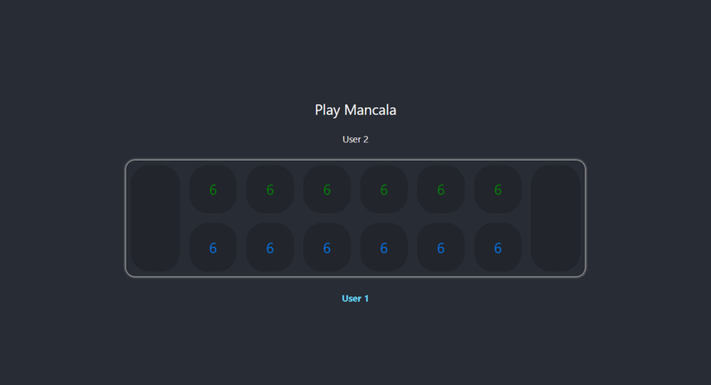

# Mancala Game

## Description
[Mancala](https://en.wikipedia.org/wiki/Mancala) is a two-player turn based game.
This is a React application for the UI of this game.

## Game Play

## License
This project is licensed under the MIT License - see the [LICENSE](LICENSE) file for details.
